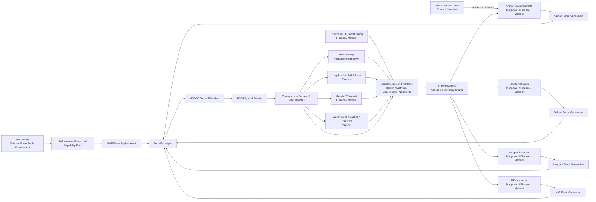

# Fraktionsziele, Ressourceneigentum, Ressourcenfluss und Kräftegenerierung

## 1. Zweck

Dieses Dokument definiert das gemeinsame Ressourcenmodell des optionalen Multi-Commander-Projekts.

Es beantwortet verbindlich:

- welche Ressourcen modelliert werden;
- woher sie stammen;
- wem sie rechtlich oder faktisch zugeordnet sind;
- welche Fraktionen um dieselben Quellen konkurrieren;
- wie Zugriff geschützt, blockiert, umgeleitet, erobert oder zerstört wird;
- wie aus virtuellen Ressourcen strategische `ForcePackage`-Objekte entstehen;
- wie DCS-/MOOSE-Ergebnisse auf den nächsten Ressourcenzyklus zurückwirken.

Das Modell simuliert keine vollständige afghanische Volkswirtschaft. Es bildet nur Ressourcen ab, die für mindestens zwei Fraktionen relevant, endlich und durch andere Fraktionen beeinflussbar sind.

## 2. Hauptprojekt- und Dokumentautoritäten

Dieses Spezialprojekt bleibt nachgeordnet gegenüber:

```text
docs/05-logistics.md
docs/15-template-library-and-spawning.md
docs/26-moose-first-development-policy.md
docs/37-campaign-architecture-and-dynamic-mission-design.md
docs/49-msr-routendesign-und-infrastrukturmarker.md
```

Technische Konkretisierung:

```text
13-campaign-state-and-event-store-schema.md
```

Fraktionsintegration:

```text
16-afghan-state-and-ansf-commander-dossier.md
18-resource-model-integration-and-dossier-amendments.md
```

```text
SPECIAL_PROJECT_MATERIEL
!= replacement for detailed logistics
```

`MATERIEL` ist ein strategisches Aggregat zur Force Generation und Erhaltung. Detaillierte Cargo-, Warehouse-, Transport-, Fuel-, Ammunition-, Maintenance- und Transfermechanik bleibt unter `docs/05-logistics.md` sowie DCS/MOOSE-Autorität.

## 3. Leitentscheidung

```text
ONLY_CONTESTED_RESOURCES_ARE_MODELED
```

Eine Größe wird nur als gemeinsame Ressource geführt, wenn mehrere Bedingungen erfüllt sind:

1. Mehrere Fraktionen benötigen dieselbe Größe.
2. Eine Fraktion kann den Zugriff einer anderen reduzieren.
3. Die Größe kann übertragen, verbraucht, blockiert, umgeleitet, erbeutet oder zerstört werden.
4. Sie beeinflusst unmittelbar Aufstellung, Erhaltung oder Wiederherstellung physischer Kräfte.
5. Sie besitzt eine endliche Kapazität oder einen begrenzten Zufluss.

```text
RESOURCE != OBJECTIVE
RESOURCE != CAPABILITY
RESOURCE != POLITICAL_STATE
RESOURCE != VICTORY_POINT
RESOURCE != DCS_ENTITY
```

## 4. Gemeinsame Grundressourcen

Version 1 verwendet genau drei gemeinsame umkämpfte Grundressourcen:

```text
RECRUITABLE_MANPOWER
FINANCE
MATERIEL
```

Physischer militärischer Output:

```text
RECRUITABLE_MANPOWER
+ FINANCE
+ MATERIEL
+ TIME
+ FACTION_SPECIFIC_ORGANIZATIONAL_GATE
-> FORCE_PACKAGE
```

`ACCESS_AND_CONTROL` ist keine vierte verbrauchbare Ressource. Es bestimmt, welcher Anteil einer Quelle eine Fraktion erreicht.

## 5. Kampagnenfraktionen und Quellenhalter

Commander-Fraktionen:

```text
ISAF
AFGHAN_STATE
TALIBAN
HAQQANI
HIG
```

Nicht kommandierte Quellenhalter:

```text
AFGHAN_POPULATION_AND_LOCAL_COMMUNITIES
LOCAL_LEGAL_ECONOMY
AFGHAN_STATE_REVENUE_SYSTEM
ILLICIT_AND_CRIMINAL_ECONOMY
INTERNATIONAL_DONOR_AND_SECURITY_ASSISTANCE
ISAF_CONTRIBUTING_NATIONS
EXTERNAL_INSURGENT_SUPPORT_NETWORKS
```

Die Bevölkerung ist kein Besitzobjekt.

```text
POPULATION != OWNED_RESOURCE
```

Fraktionen konkurrieren um Zugang und Anteil, nicht um Eigentum an Menschen.

## 6. Eigentum, Kontrolle und Nutzen

Jeder relevante Knoten unterscheidet:

```text
LEGAL_OWNER
PHYSICAL_CONTROLLER
CURRENT_BENEFICIARIES
ACCESS_SHARES
```

```text
LEGAL_OWNER != PHYSICAL_CONTROLLER
PHYSICAL_CONTROLLER != SOLE_BENEFICIARY
CONTROL != COMPLETE_EXTRACTION
```

Beispiel:

```yaml
resource_node:
  node_id: REVENUE_CHECKPOINT_017
  resource_type: FINANCE
  legal_owner: AFGHAN_STATE
  physical_controller: AFGHAN_STATE
  beneficiary_shares:
    AFGHAN_STATE: 55
    TALIBAN: 15
    HIG: 5
    CORRUPTION_LEAKAGE: 25
  disruption_level: 20
```

Ein staatlich gehaltener Checkpoint kann Einnahmen durch Korruption, Einschüchterung oder Schattenbesteuerung verlieren.

## 7. RECRUITABLE_MANPOWER

### 7.1 Definition

`RECRUITABLE_MANPOWER` repräsentiert Personen, die grundsätzlich für eine staatliche Sicherheitsorganisation oder bewaffnete Fraktion gewonnen werden könnten.

Die Ressource wird regional geführt.

```yaml
manpower_source:
  source_id: MANPOWER_DISTRICT_TAGAB
  region_id: DISTRICT_TAGAB
  capacity: 500
  available: 170
  regeneration_per_turn: 8
  exhaustion_level: 25
  access_shares:
    AFGHAN_STATE: 35
    TALIBAN: 40
    HIG: 20
    HAQQANI: 5
```

ISAF rekrutiert keine Eigenkräfte aus diesem Pool.

### 7.2 Zugang

Zugang kann entstehen durch:

- staatliche Legitimität und Sicherheit;
- verlässliche Bezahlung und Ausbildung;
- freiwillige politische oder ideologische Unterstützung;
- familiäre, lokale und Patronagenetzwerke;
- finanzielle Anreize;
- Bindung an lokale Commander;
- Einschüchterung oder Zwang.

```text
VOLUNTARY_SUPPORT != COERCIVE_CONTROL
```

### 7.3 Endlichkeit

```text
ONE_RECRUITED_PERSON
cannot simultaneously support
TWO_FORCE_PACKAGES
```

Rekrutierung, Verluste, Abwanderung und Erschöpfung reduzieren den Pool. Regeneration erfolgt langsam und bis zu einer Kapazitätsgrenze.

## 8. FINANCE

Finance ermöglicht:

- Sold und Unterhalt;
- Rekrutierung und Patronage;
- Transport und Versorgung;
- Erwerb oder Erhaltung von Materiel;
- Organisations- und Kommunikationsstrukturen;
- Ausbildung und Force Generation.

Mögliche Source-Klassen:

```text
AFGHAN_STATE_REVENUE
FORMAL_TAX_AND_CUSTOMS
INTERNATIONAL_DONOR_AND_SECURITY_ASSISTANCE
LOCAL_LEGAL_ECONOMY
SHADOW_TAXATION
ILLICIT_ECONOMY
EXTERNAL_INSURGENT_SUPPORT
PATRONAGE_CHANNELS
```

Nicht jede Fraktion darf jede Quelle nutzen.

```text
ALL_RED_FINANCE != DRUG_MONEY
```

Drogen-, Schmuggel- und andere illegale Zuflüsse werden nur regional und quellenbegründet aktiviert.

### 8.1 Externe Unterstützung

```yaml
external_red_support_source:
  finance_per_turn: 30
  materiel_per_turn: 12
  allocation_shares:
    TALIBAN: 35
    HAQQANI: 50
    HIG: 15
```

Ein höherer Anteil einer RED-Fraktion reduziert den gleichzeitig verfügbaren Anteil der anderen oder lässt einen Rest unallocated. Der Pool ist endlich.

### 8.2 ISAF und internationale Mittel

ISAF-eigene nationale Finance und Kontingente liegen außerhalb des gemeinsamen afghanischen Ressourcenraums.

```text
ISAF_EXTERNAL_RESOURCE
enters common campaign resource flow
only after an authorized transfer to AFGHAN_STATE
```

Vor der Übertragung ist es kein Afghan-State-ResourceAccount. Nach der Übertragung gelten Eigentums-, Transfer- und Idempotenzregeln.

## 9. MATERIEL

`MATERIEL` umfasst strategisch die materielle Grundlage eines Force Packages:

```text
WEAPONS
AMMUNITION
VEHICLES
COMMUNICATIONS_EQUIPMENT
PROTECTIVE_EQUIPMENT
FUEL_AND_MAINTENANCE_AGGREGATE
TEMPLATE_SPECIFIC_EQUIPMENT
```

Mögliche physische oder virtuelle Bindungen:

```text
WAREHOUSE
BASE
CACHE
CONVOY
CARGO
EXTERNAL_SUPPORT_CHANNEL
REGIONAL_DEPOT
```

Materiel kann:

```text
DELIVERED
RESERVED
CONSUMED
CAPTURED
DIVERTED
DESTROYED
LOST
TRANSFERRED
```

werden.

Verbindlich:

```text
TRANSFER != GENERATION
DUPLICATE_DELIVERY_EVENT != SECOND_CREDIT
MISSING != CAPTURED
DESTROYED != TRANSFERRED
```

Detaillierte physische Ausführung bleibt MOOSE/DCS beziehungsweise `docs/05-logistics.md` vorbehalten.

## 10. AccessNodes und ResourceSources

AccessNodes bestimmen Zugriff auf Quellen:

```text
DISTRICT
ROUTE
CHECKPOINT
MARKET
CROSSING
BASE
WAREHOUSE
CACHE
RECRUITMENT_NETWORK
EXTERNAL_SUPPORT_CHANNEL
```

```yaml
access_node:
  node_id: string
  node_type: string
  legal_owner_faction_id: string|null
  physical_controller_faction_id: string|null
  connected_resource_source_refs: []
  beneficiary_shares: {}
  access_shares: {}
  disruption_level: 0..100
  materialization_policy: virtual_only|event_only|hybrid|physical_required
```

Kontrollwechsel verändert Zugriff nicht zwingend sofort vollständig. Bestehende Netzwerke, Korruption, Schattenbesteuerung oder versteckte Routen können fortbestehen.

## 11. ForcePackage und ForceUnit

```text
ForcePackage
= strategisches ressourcengedecktes Kräftepaket,
  das reserviert und materialisiert werden kann

ForceUnit
= persistente Teilstruktur oder konkrete Einheit
  innerhalb eines ForcePackage
```

Beispiele für Force Packages:

```text
INFANTRY_PACKAGE
INSURGENT_CELL_PACKAGE
QRF_PACKAGE
CONVOY_PACKAGE
ROUTE_SECURITY_PACKAGE
AIR_MISSION_CAPACITY
ISR_PACKAGE
LOGISTICS_PACKAGE
```

Ein ForcePackage kann eine oder mehrere DCS-Gruppen oder ein zeitlich begrenztes Missionspaket repräsentieren. Die konkrete DCS-/MOOSE-Zuordnung folgt Dokument 13, Template-Autorität und MOOSE-Prüfung.

```text
FORCE_PACKAGE != INVENTED_TEMPLATE
```

`template_ref` muss auf eine vorhandene, genehmigte Quelle verweisen.

## 12. Fraktionsspezifische Kräftegenerierung

### 12.1 ISAF

```text
NATIONAL_FORCE_POOL
+ COALITION_COMMITMENT
+ REPLACEMENT_CAPACITY
+ TIME
-> ISAF_FORCE_PACKAGE
```

ISAF verwendet keinen afghanischen Manpower-Pool.

### 12.2 Afghan State

```text
FINANCE
+ RECRUITABLE_MANPOWER
+ MATERIEL
+ TRAINING_CAPACITY
+ RETENTION
+ LEADERSHIP
+ SUSTAINMENT
+ TIME
-> AFGHAN_FORCE_PACKAGE
```

### 12.3 Taliban

```text
FINANCE
+ RECRUITABLE_MANPOWER
+ MATERIEL
+ CADRE_CAPACITY
+ COMMAND_LINK
+ TIME
-> TALIBAN_FORCE_PACKAGE
```

### 12.4 Haqqani

```text
FINANCE
+ SELECTED_RECRUITABLE_MANPOWER
+ MATERIEL
+ NETWORK_ACCESS
+ TRUSTED_CADRE_OR_SPECIALIST_GATE
+ ROUTE_AND_STAGING_ACCESS
+ TIME
-> HAQQANI_FORCE_PACKAGE
```

### 12.5 HIG

```text
FINANCE
+ REGIONAL_RECRUITABLE_MANPOWER
+ MATERIEL
+ PATRONAGE_ACCESS
+ LOCAL_COMMANDER_GATE
+ TIME
-> HIG_FORCE_PACKAGE
```

## 13. Zustände, die keine Ressourcen sind

```text
LEGITIMACY
REPUTATION
VOLUNTARY_SUPPORT
COERCIVE_CONTROL
PRESTIGE
LOYALTY
COMMAND_COHESION
HUMINT_ACCESS
SPECIALIST_ACCESS
TRAINING_CAPACITY
COALITION_COMMITMENT
```

Diese Größen beeinflussen Zugriff, Risiko, Erhaltung, Gate-Prüfungen oder Regeneration.

```text
HIGH_SUPPORT != NEW_UNIT
HIGH_REPRESSION != NEW_UNIT
HIGH_PRESTIGE != NEW_UNIT
```

## 14. HUMINT und Information

Information ist keine vierte frei handelbare Grundressource. Sie entsteht als Ertrag aus Zugang, Vertrauen, Überwachung und Quellenschutz.

```text
HUMINT_YIELD
=
POPULATION_ACCESS
× INFORMATION_WILLINGNESS
× SOURCE_SECURITY
× REPORTING_CAPACITY
× INFORMATION_RELIABILITY
```

ISAF, Afghan State und RED können unterschiedliche Information aus demselben Raum gewinnen.

## 15. Ressourcenentzug

### 15.1 Manpower

- eigenen Rekrutierungsanteil erhöhen;
- gegnerische Rekrutierungsnetzwerke stören;
- Bevölkerung schützen;
- lokale Commander binden oder abwerben;
- Defektion oder Demobilisierung ermöglichen;
- Zwangszugang reduzieren.

### 15.2 Finance

- Revenue Nodes und Checkpoints sichern;
- Schmuggel- oder Schattensteuerflüsse unterbrechen;
- externe Kanäle stören;
- Korruption und Umleitung reduzieren;
- Rivalenanteile über AccessNode-Kontrolle oder Agreements verändern.

### 15.3 Materiel

- Warehouses oder Caches sichern;
- Transfers schützen oder unterbrechen;
- Transporte abfangen;
- Bestände zerstören oder evakuieren;
- erbeutete Bestände ausdrücklich adjudizieren.

## 16. Ressourcenkreislauf – schriftliche Beschreibung

Der Kampagnenzyklus ist verbindlich:

```text
1. ResourceSources besitzen endliche Kapazität oder begrenzten Zufluss.
2. ResourceSource Tick erzeugt eine Bruttomenge.
3. Störung Erschöpfung und Verlust reduzieren die Bruttomenge.
4. AccessNodes Kontrolle Beziehungen Legitimität Unterstützung und Zwang
   bestimmen Fraktionsanteile.
5. Anteile werden auf ResourceAccounts gutgeschrieben.
6. Fraktionen reservieren Finance Manpower und Materiel.
7. Ressourcen werden für Force Generation Transfers oder Operationen gebunden.
8. ForceGenerationOrders erzeugen nach Zeit und Gate-Prüfung ForcePackages.
9. MOOSE materialisiert nur genehmigte ForcePackages und Operationen.
10. DCS/MOOSE meldet physische Ergebnisse.
11. Der Orchestrator adjudiziert Verluste Kontrolle und Ressourcenwirkung.
12. Resultierende Events verändern Quellen Konten Shares Kräfte und Beliefs.
13. Der nächste Kampagnenturn beginnt mit dem veränderten Zustand.
```

Damit ist der Kreislauf geschlossen. Keine Einheit und keine Ressource entsteht ohne Herkunft.

## 17. Ressourcenflussdiagramm



Die Bedeutung hängt nicht allein von Farben ab. Beschriftung und Struktur sind autoritativ.

## 18. Bestandsformel

```text
STOCK_NEXT
=
MIN(
  CAPACITY,
  STOCK_CURRENT
  + GENERATED
  + TRANSFERRED_IN
  - RESERVED
  - COMMITTED
  - CONSUMED
  - DESTROYED
  - TRANSFERRED_OUT
  - DIVERTED
)
```

Jede Änderung benötigt ein Event und Provenienz.

## 19. MOOSE-First-Grenze

```text
CAMPAIGN_STATE_ORCHESTRATOR
- holds sources accounts shares reservations and authorization
- creates no DCS unit directly

MOOSE
- uses approved templates
- materializes and manages ForcePackages
- assigns tactical tasks
- reports execution states and results

DCS
- simulates physical entities and events
```

Vor eigenem Lua-Code ist die tatsächlich eingebundene MOOSE-Version 2.9.18 einschließlich Quellen und Dokumentation zu prüfen.

Mindestens relevante Bereiche:

```text
WAREHOUSE
SPAWN
SPAWNSTATIC
OPSGROUP
ARMYGROUP
AUFTRAG
COMMANDER
CHIEF
AIRWING
SQUADRON
OPSTRANSPORT
CTLD
EVENTS
FSM
```

## 20. Verbindliche Invarianten

```text
NO_RESOURCE_GENERATION_WITHOUT_SOURCE
NO_NEGATIVE_RESOURCE_ACCOUNT
NO_DOUBLE_RESOURCE_RESERVATION
NO_DUPLICATE_RESOURCE_CREDIT
NO_FORCE_PACKAGE_WITHOUT_RESOURCE_COMMITMENT
NO_FORCE_PACKAGE_WITHOUT_AUTHORIZED_TEMPLATE_REF
NO_ISAF_RECRUITMENT_FROM_AFGHAN_MANPOWER
NO_POPULATION_OWNERSHIP
NO_REPUTATION_TO_DIRECT_UNIT_CONVERSION
NO_TRANSFER_AS_GENERATION
NO_DESTROYED_MATERIEL_CREDIT
NO_AFGHAN_FORCE_OWNED_BY_ISAF
NO_PHYSICAL_EXECUTION_BEFORE_MOOSE_ADAPTER_ACCEPTANCE
```

## 21. Minimaler Implementierungsumfang

Version 1 benötigt:

```text
ResourceSource
ResourceAccount
ResourceReservation
ResourceTransfer
ResourceFlow
AccessNode
FactionShare
ForceGenerationOrder
ForcePackage
ForceUnit
MaterializationMapping
```

Nicht simuliert werden:

```text
individual soldiers
individual weapons
complete national budgets
inflation
market pricing
full narcotics production chain
complete civilian economy
individual prisoners
```

## 22. Acceptance-Kriterien

Das Modell ist akzeptiert, wenn:

- jede Ressource eine Quelle oder autorisierten Transfer besitzt;
- jede neue Force Generation vollständige Provenienz besitzt;
- mehrere Fraktionen um dieselben endlichen Quellen konkurrieren können;
- Eigentum, Kontrolle und Nutzen getrennt bleiben;
- ISAF-Ressourcen erst nach Transfer Teil des Afghan-State-Flusses werden;
- MATERIEL nicht die detaillierte Hauptprojektlogistik ersetzt;
- ForcePackage und ForceUnit klar getrennt sind;
- keine DCS- oder MOOSE-Objekte erfunden werden;
- DCS-/MOOSE-Ergebnisse den nächsten Ressourcenzyklus nachvollziehbar verändern;
- deterministischer Replay alle Konten und Shares reproduziert.

## 23. Querverweise

```text
01-source-inventory-and-faction-baseline.md
02-common-commander-model.md
03-inter-faction-relations-and-negotiation.md
07-runtime-rulebook-and-action-schema.md
09-orchestrator-architecture-and-adjudication.md
12-multi-commander-test-scenarios.md
13-campaign-state-and-event-store-schema.md
14-deterministic-test-harness-and-scripted-commanders.md
15-orchestrator-technology-selection-and-deployment-model.md
16-afghan-state-and-ansf-commander-dossier.md
18-resource-model-integration-and-dossier-amendments.md
```
