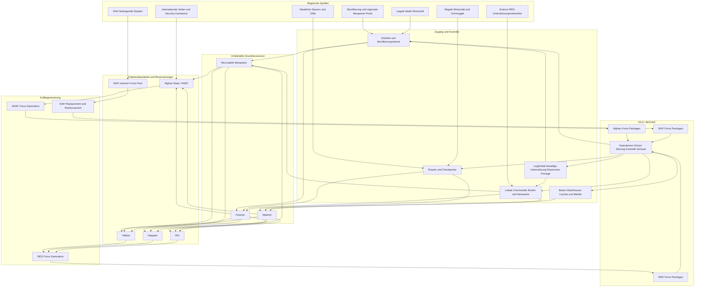

# Fraktionsziele, Ressourceneigentum, Ressourcenfluss und Kräftegenerierung

## 1. Zweck

Dieses Dokument definiert das gemeinsame Ressourcenmodell des optionalen Multi-Commander-Projekts.

Es beantwortet verbindlich:

- welche Ressourcen modelliert werden;
- woher diese Ressourcen stammen;
- wem sie rechtlich oder faktisch zugeordnet sind;
- welche Fraktionen um dieselben Ressourcen konkurrieren;
- wie Ressourcen geschützt, blockiert, umgeleitet, erobert oder zerstört werden können;
- wie aus virtuellen Ressourcen physische `ForcePackage`-Objekte entstehen;
- wie DCS/MOOSE-Ergebnisse auf den nächsten Ressourcenzyklus zurückwirken.

Das Modell simuliert keine vollständige afghanische Volkswirtschaft. Es bildet nur Ressourcen ab, die für mindestens zwei Fraktionen relevant und durch andere Fraktionen beeinflussbar sind.

## 2. Leitentscheidung

```text
ONLY_CONTESTED_RESOURCES_ARE_MODELED
```

Eine Größe wird nur als Ressource geführt, wenn mindestens zwei der folgenden Bedingungen erfüllt sind:

1. Mehrere Fraktionen benötigen dieselbe Größe.
2. Eine Fraktion kann den Zugriff einer anderen Fraktion auf diese Größe reduzieren.
3. Die Größe kann übertragen, verbraucht, blockiert, umgeleitet, erobert oder zerstört werden.
4. Die Größe beeinflusst unmittelbar die Aufstellung, Erhaltung oder Wiederherstellung physischer Kräfte.
5. Die Größe besitzt eine endliche Kapazität oder einen begrenzten Zufluss.

Nicht jede wichtige Kampagnengröße ist deshalb eine Ressource.

```text
RESOURCE != OBJECTIVE
RESOURCE != CAPABILITY
RESOURCE != POLITICAL_STATE
RESOURCE != VICTORY_POINT
RESOURCE != DCS_ENTITY
```

## 3. Technische Grundannahme

DCS und MOOSE stellen primär dar:

```text
UNITS_AND_GROUPS
AIRCRAFT
VEHICLES
BASES
FARPS
WAREHOUSES
CARGO
STATIC_OBJECTS
PHYSICAL_MISSION_EVENTS
```

Das gemeinsame Ressourcenmodell wird im CampaignState geführt.

```text
CAMPAIGN_STATE
-> owns virtual stocks, sources, shares and reservations

ORCHESTRATOR
-> validates resource use and force generation

MOOSE
-> materializes approved force packages and missions

DCS
-> simulates physical execution
```

Der Orchestrator darf keine Einheit unmittelbar erzeugen. Er darf nur ein genehmigtes und ressourcengedecktes `ForcePackage` an den MOOSE-Adapter übergeben.

## 4. Gemeinsame umkämpfte Grundressourcen

Version 1 verwendet genau drei gemeinsame Grundressourcen:

```text
1. RECRUITABLE_MANPOWER
2. FINANCE
3. MATERIEL
```

Aus ihnen entsteht der physische militärische Output:

```text
RECRUITABLE_MANPOWER
+ FINANCE
+ MATERIEL
+ TIME
+ FACTION_SPECIFIC_ORGANIZATIONAL_GATE

-> FORCE_PACKAGE
```

`ACCESS_AND_CONTROL` ist keine vierte verbrauchbare Ressource. Es ist die Verteilungsschicht, die bestimmt, welcher Anteil einer Quelle eine Fraktion erreicht.

## 5. Nicht kommandierte Ressourcenhalter

Nicht jede Ressource gehört zu Beginn einer Commander-Fraktion.

Das Modell kennt folgende nicht kommandierte Quellenhalter:

```text
AFGHAN_POPULATION_AND_LOCAL_COMMUNITIES
LOCAL_LEGAL_ECONOMY
AFGHAN_STATE_REVENUE_SYSTEM
ILLICIT_AND_CRIMINAL_ECONOMY
INTERNATIONAL_DONOR_AND_SECURITY_ASSISTANCE
ISAF_CONTRIBUTING_NATIONS
EXTERNAL_INSURGENT_SUPPORT_NETWORKS
```

Die Bevölkerung ist kein Besitzobjekt.

```text
POPULATION != OWNED_RESOURCE
```

Die Bevölkerung hält beziehungsweise regeneriert regionales Rekrutierungspotenzial und erzeugt lokale Wirtschafts- und Informationsströme. Fraktionen konkurrieren um Zugang, Vertrauen, Befolgung und Anteil, nicht um Eigentum an Menschen.

## 6. Eigentum, Kontrolle und Nutzen

Jeder Ressourcen- oder Zugangsknoten unterscheidet:

```text
LEGAL_OWNER
PHYSICAL_CONTROLLER
CURRENT_BENEFICIARIES
ACCESS_SHARES
```

Diese Werte können voneinander abweichen.

```text
LEGAL_OWNER != PHYSICAL_CONTROLLER
PHYSICAL_CONTROLLER != SOLE_BENEFICIARY
CONTROL != COMPLETE_EXTRACTION
```

Beispiel:

```yaml
resource_node:
  node_id: REVENUE_CHECKPOINT_017
  node_type: FORMAL_ROUTE_REVENUE
  legal_owner: AFGHAN_STATE
  physical_controller: AFGHAN_STATE
  beneficiary_shares:
    AFGHAN_STATE: 55
    TALIBAN: 15
    HIG: 5
    CORRUPTION_LEAKAGE: 25
  disruption_level: 20
```

Ein staatlich gehaltener Checkpoint kann somit trotz formaler Kontrolle Einnahmen durch Korruption, Einschüchterung oder Schattenbesteuerung verlieren.

## 7. Ressourcentyp 1: Recruitable Manpower

### 7.1 Definition

```text
RECRUITABLE_MANPOWER
```

repräsentiert Personen, die grundsätzlich für eine bewaffnete oder staatliche Sicherheitsorganisation gewonnen werden könnten.

Die Ressource wird regional geführt.

```yaml
manpower_source:
  source_id: MANPOWER_DISTRICT_TAGAB
  region_id: DISTRICT_TAGAB
  capacity: 500
  available: 170
  regeneration_per_turn: 8
  exhaustion_level: 25
  access_shares:
    AFGHAN_STATE: 35
    TALIBAN: 40
    HIG: 20
    HAQQANI: 5
```

### 7.2 Endlichkeit

Ein rekrutierter Anteil wird aus dem verfügbaren Pool abgezogen.

```text
ONE_RECRUITED_PERSON
cannot simultaneously serve
TWO_FORCE_PACKAGES
```

Der Pool regeneriert nur langsam und bis zu einer regionalen Kapazitätsgrenze.

Regeneration kann sinken durch:

```text
combat_losses
migration
population_displacement
economic_collapse
high_repression
recruitment_exhaustion
loss_of_working_age_population
```

### 7.3 Zugangsanteile

Zugang entsteht durch unterschiedliche Mechanismen.

Afghan State:

```text
state_legitimacy
ansf_reputation
reliable_pay
career_incentive
security
local_recruitment_network
protection_of_recruits_and_families
```

Taliban:

```text
voluntary_support
ideological_alignment
local_social_networks
financial_incentive
shadow_governance
coercive_control
local_commander_influence
```

Haqqani:

```text
trusted_network_access
brokerage
selected_recruitment
cadre_selection
external_relationships
```

HIG:

```text
patronage
regional_party_network
local_commander_loyalty
political_identity
financial_incentive
```

### 7.4 Konkurrenz

Mehr Zugang einer Fraktion reduziert den verfügbaren Anteil anderer Fraktionen.

Beispiele:

```text
AFGHAN_STATE protects recruiters and pays reliably
-> state recruitment share rises
-> RED recruitment shares fall
```

```text
TALIBAN gains local control and credible coercive reach
-> Taliban access rises
-> state and HIG access may fall
```

```text
HIG retains a regional commander
-> associated manpower remains HIG-accessible
-> Taliban cannot use the same commander network
```

```text
HAQQANI recruits a scarce specialist cadre
-> that cadre is unavailable to other RED factions
```

## 8. Ressourcentyp 2: Finance

### 8.1 Definition

```text
FINANCE
```

repräsentiert die Mittel, die eine Fraktion zur Aufstellung und Erhaltung ihrer Force Packages sowie für Transport, Versorgung, Patronage und Organisationsstrukturen benötigt.

Finanzen entstehen nicht ohne Quelle.

### 8.2 Finanzquellen

Version 1 kennt:

```text
AFGHAN_STATE_REVENUE
FORMAL_TAX_AND_CUSTOMS
LOCAL_LEGAL_ECONOMY
ILLICIT_ECONOMY
LOCAL_TAXATION_AND_PROTECTION_PAYMENTS
INTERNATIONAL_DONOR_SUPPORT
SECURITY_ASSISTANCE_FUNDING
EXTERNAL_INSURGENT_SUPPORT
```

Nicht jede Fraktion darf jede Quelle nutzen.

### 8.3 Staatliche und legale Einnahmen

Mögliche Empfänger:

```text
AFGHAN_STATE
LOCAL_GOVERNMENT
CORRUPTION_LEAKAGE
RED_SHADOW_TAXATION
```

Beispiel:

```yaml
finance_source:
  source_id: FINANCE_MARKET_TAGAB
  source_type: LOCAL_LEGAL_ECONOMY
  capacity_per_turn: 25
  current_generation: 20
  legal_owner: CIVILIAN_ECONOMY
  beneficiary_shares:
    AFGHAN_STATE: 35
    TALIBAN: 30
    HIG: 15
    CRIMINAL_LEAKAGE: 20
```

### 8.4 Illegale Wirtschaft

Illegale Quellen können umfassen:

```text
smuggling
narcotics_related_revenue
black_market
protection_payments
illegal_taxation
diversion_of_state_or_aid_funds
```

Sie werden nur regional und quellenbegründet aktiviert.

```text
ALL_RED_FINANCE != NARCOTICS_REVENUE
```

Die Drogenwirtschaft ist ein möglicher regionaler Einnahmekanal, aber kein pauschaler universeller RED-Finanzgenerator.

### 8.5 Externe RED-Unterstützung

Externe Unterstützung wird als begrenzter Zufluss modelliert.

```yaml
external_red_support_source:
  source_id: EXT_RED_SUPPORT_01
  finance_per_turn: 30
  materiel_per_turn: 12
  access_shares:
    TALIBAN: 35
    HAQQANI: 50
    HIG: 15
  disruption_level: 10
```

Die Anteile können beeinflusst werden durch:

```text
prestige
relationship_quality
reliability
operational_security
channel_security
recent_success
leadership_access
```

Damit konkurrieren RED-Fraktionen um einen endlichen externen Zufluss, ohne dass dieser zuvor dem afghanischen Staat gehören muss.

### 8.6 ISAF-Finanzierung

Eigene ISAF-Kräfte werden nicht aus der afghanischen lokalen Wirtschaft finanziert.

```text
ISAF_OWN_FORCE_FINANCE
is outside
COMMON_AFGHAN_RESOURCE_POOL
```

ISAF und beitragende Staaten besitzen einen externen nationalen Kräfte- und Finanzierungsrahmen. Dessen Kampagnenabstraktion ist `COALITION_COMMITMENT` beziehungsweise `NATIONAL_FORCE_POOL`.

ISAF kann jedoch den afghanischen Staat über Geber- und Sicherheitsunterstützung finanzieren.

## 9. Ressourcentyp 3: Materiel

### 9.1 Definition

```text
MATERIEL
```

umfasst die abstrahierte materielle Grundlage eines Force Packages:

```text
weapons
ammunition
vehicles
communications_equipment
protective_equipment
fuel
maintenance_parts
template_specific_equipment
```

### 9.2 Physische und virtuelle Darstellung

Materiel kann gebunden sein an:

```text
DCS_WAREHOUSE
BASE
FARP
PHYSICAL_CARGO
CONVOY
RED_CACHE
VIRTUAL_EXTERNAL_SUPPLY_NODE
```

Wo DCS-Warehouses oder Cargo die Ressource ausreichend darstellen können, sind diese Mechanismen zu verwenden. Nicht abbildbare Bodenausrüstung bleibt im CampaignState, benötigt aber einen benannten Herkunfts- oder Lagerknoten.

### 9.3 Zustandsänderungen

Materiel kann:

```text
AVAILABLE
RESERVED
IN_TRANSIT
DELIVERED
CONSUMED
DAMAGED
LOST
DESTROYED
CAPTURED
DIVERTED
TRANSFERRED
```

sein.

### 9.4 Beispiel eines staatlichen Warehouses

```yaml
materiel_node:
  node_id: WH_ANSF_TAGAB
  legal_owner: AFGHAN_STATE
  physical_controller: AFGHAN_STATE
  available: 80
  reserved: 20
  corruption_or_diversion_share: 10
  dcs_warehouse_id: WH_DCS_TAGAB_01
```

Nach Kontrollverlust:

```yaml
resolution:
  captured_by_taliban: 35
  destroyed: 20
  evacuated_by_afghan_state: 15
  unaccounted_or_diverted: 10
```

### 9.5 RED-Konkurrenz

Taliban, Haqqani und HIG können konkurrieren um:

```text
caches
weapons_flows
smuggling_routes
captured_state_materiel
external_support_allocations
vehicles
communications_equipment
scarce_specialized_equipment
```

Ein Cache oder Materielstrom kann nicht vollständig gleichzeitig mehreren Fraktionen zugerechnet werden.

## 10. Zugriff und Kontrolle

### 10.1 Definition

```text
ACCESS_AND_CONTROL
```

bestimmt, welche Fraktion welchen Anteil einer Ressourcenquelle nutzen kann.

Zugangsknoten:

```text
districts
villages_and_population_areas
routes
checkpoints
border_and_transit_corridors
bases
warehouses
caches
markets
smuggling_nodes
local_broker_networks
```

### 10.2 Kontrollwerte

```yaml
access_node:
  node_id:
  node_type:
  region_id:
  legal_owner:
  physical_controller:
  influence_shares: {}
  security_level: 0..100
  disruption_level: 0..100
  connected_resource_sources: []
  dcs_mapping_id:
```

### 10.3 Kontrolle ist nicht absolut

```text
PHYSICAL_CONTROL
may increase access
but does not guarantee
TOTAL_RESOURCE_EXTRACTION
```

Beispiel:

- ANSF hält einen Markt, aber Taliban erhalten weiterhin Schattenabgaben.
- Taliban dominieren nachts einen Distrikt, aber staatliche Rekrutierung bleibt teilweise möglich.
- HIG kontrolliert einen lokalen Commander, während Taliban die Hauptstraße beeinflussen.
- Haqqani besitzt eine sichere Facilitation-Beziehung, ohne den gesamten Distrikt zu verwalten.

## 11. Zustandswerte und abgeleitete Größen

Folgende Größen sind ausdrücklich keine Grundressourcen:

```text
LEGITIMACY
REPUTATION
VOLUNTARY_SUPPORT
COERCIVE_CONTROL
PRESTIGE
MORALE
LOYALTY
COMMAND_COHESION
OPERATIONAL_SECURITY
HUMINT_ACCESS
CAPABILITY
```

Sie verändern Zugangsanteile, Regenerationsraten, Verlustrisiken oder Force-Generation-Gates.

### 11.1 Freiwillige Unterstützung und Repression

```text
VOLUNTARY_SUPPORT != COERCIVE_CONTROL
```

Freiwillige Unterstützung kann erhöhen:

```text
recruitment_access
information_willingness
low_cost_logistics_support
source_reliability
personnel_retention
```

Repression kann kurzfristig erhöhen:

```text
compliance
forced_payments
silence
forced_recruitment
reporting_to_red
```

Sie kann langfristig vermindern:

```text
voluntary_support
local_economic_output
population_stability
personnel_retention
```

und bei glaubwürdigem Schutz durch Gegner verdeckte Gegenkooperation fördern.

### 11.2 HUMINT

HUMINT ist kein frei übertragbarer Ressourcenbestand.

```text
HUMINT_YIELD
=
POPULATION_ACCESS
× INFORMATION_WILLINGNESS
× SOURCE_PROTECTION
× REPORTING_CAPACITY
× RELIABILITY
```

BLUE, Afghan State und RED können gleichzeitig unterschiedliche Informationszugänge besitzen.

## 12. Fraktionsziele und Ressourcenbedarf

### 12.1 BLUE / ISAF

BLUE will nicht die afghanischen Ressourcen selbst besitzen.

BLUE will:

```text
prevent strategic terrorist safe haven
reduce RED operational capability
protect priority populations and forces
preserve critical routes and bases
support Afghan security capability
reduce RED access to manpower finance and materiel
enable sustainable Afghan control
preserve coalition commitment
```

Die Kernformel lautet:

```text
ISAF_SUCCESS
=
AFGHAN_STATE gains sustainable access
to MANPOWER, FINANCE and MATERIEL

while

RED access becomes insufficient
to sustain strategic objectives
```

Eigene ISAF-Kräfte stammen aus:

```text
NATIONAL_FORCE_POOL
+ COALITION_COMMITMENT
+ REPLACEMENT_CAPACITY
+ TIME

-> ISAF_FORCE_PACKAGE
```

Diese Quelle liegt außerhalb des gemeinsamen afghanischen Ressourcenraums. RED beeinflusst sie indirekt durch Verluste, Kosten, politische Rückschläge, Dauer und wahrgenommenen Fortschritt.

Lokales ISAF-Ansehen erzeugt keine ISAF-Einheiten. Es beeinflusst Zugang, HUMINT und politische Operationsbedingungen.

### 12.2 Afghan State / ANSF

Der afghanische Staat will:

```text
preserve state survival
secure legal revenue and donor support
expand recruitment access
retain personnel
control state materiel
hold districts routes bases and checkpoints
reduce insurgent parallel control
increase Afghan-led capability
```

Force Generation:

```text
FINANCE
+ RECRUITABLE_MANPOWER
+ MATERIEL
+ TRAINING_CAPACITY
+ RETENTION
+ TIME

-> AFGHAN_FORCE_PACKAGE
```

### 12.3 Taliban

Die Taliban wollen:

```text
preserve leadership and network cohesion
maintain local political and intelligence access
expand shadow control
secure recruitment finance and logistics
undermine government legitimacy
restrict BLUE and ANSF freedom of action
retain reinfiltration capability
accelerate foreign withdrawal
```

Force Generation:

```text
FINANCE
+ RECRUITABLE_MANPOWER
+ MATERIEL
+ CADRE_CAPACITY
+ TIME

-> TALIBAN_FORCE_PACKAGE
```

Taliban konkurrieren besonders um:

```text
local recruitment
shadow taxation
local legal and illicit revenue shares
district and route access
caches
captured state materiel
voluntary support
coercive compliance
```

### 12.4 Haqqani

Haqqani will:

```text
preserve core family and leadership network
maintain external support and sanctuary access
preserve facilitation routes and brokers
secure selected manpower and cadres
retain finance materiel and specialist access
preserve high-impact operational capability
increase prestige and influence
```

Force Generation:

```text
FINANCE
+ SELECTED_MANPOWER
+ MATERIEL
+ NETWORK_ACCESS
+ CADRE_OR_SPECIALIST_GATE
+ TIME

-> HAQQANI_FORCE_PACKAGE
```

Haqqani konkurriert besonders um:

```text
external support allocation
secure routes
brokers
specialist capacity
staging nodes
selected recruits
captured or purchased materiel
```

### 12.5 HIG

HIG will:

```text
survive as a distinct actor
preserve regional political and military networks
retain local commanders
secure patronage and revenue
maintain recruitment access
preserve negotiation leverage
avoid marginalization by Taliban or government
```

Force Generation:

```text
FINANCE
+ REGIONAL_MANPOWER
+ MATERIEL
+ PATRONAGE_ACCESS
+ LOCAL_COMMANDER_GATE
+ TIME

-> HIG_FORCE_PACKAGE
```

HIG konkurriert besonders um:

```text
regional recruitment
local commanders
patronage finance
local revenue shares
political representation
caches and captured materiel
```

## 13. Wer entzieht wem Ressourcen?

### 13.1 RED entzieht dem Afghan State

Mögliche Entzugsfelder:

```text
formal tax and customs revenue
checkpoint and route revenue
state materiel
warehouses and cargo
vehicles and communications equipment
recruitment access
local government personnel
ANSF personnel through defection
control of districts and routes
```

### 13.2 RED entzieht der Bevölkerung und lokalen Wirtschaft

Nicht als Eigentum an Menschen, sondern durch Abschöpfung oder Zugang:

```text
recruits
shadow taxes
protection payments
food transport and shelter support
information
local broker services
```

### 13.3 RED entzieht illegalen oder kriminellen Netzen

```text
smuggling fees
illicit taxation
black market materiel
financial transfer access
route shares
```

### 13.4 RED entzieht anderen RED-Fraktionen

```text
recruitment shares
local commander loyalty
revenue shares
external sponsor allocation
weapons and caches
facilitation routes
safehouses and staging access
brokers and specialists
political representation
```

### 13.5 BLUE und Afghan State entziehen RED

```text
protect population from coercion
secure recruitment and revenue nodes
interdict illicit flows
capture or destroy caches
protect warehouses and convoys
hold routes and checkpoints
reduce shadow taxation
separate local actors from RED networks
reduce external support access
```

## 14. Ressourcenflussdiagramm



## 15. Ressourcenzyklus

```text
SOURCES
-> ACCESS_AND_CONTROL
-> FACTION_SHARES
-> FACTION_RESOURCE_ACCOUNTS
-> RESERVATION
-> FORCE_GENERATION
-> FORCE_PACKAGES
-> DCS_MOOSE_OPERATIONS
-> LOSSES_AND_CONTROL_CHANGE
-> UPDATED_SOURCES_AND_SHARES
```

Der Zyklus wird pro Campaign Turn oder durch relevante Ereignisse ausgelöst.

## 16. Endlichkeit und Regeneration

### 16.1 Bestandsformel

```text
STOCK_NEXT
=
MIN(
  CAPACITY,
  STOCK_CURRENT
  + GENERATED
  + TRANSFERRED_IN
  - CONSUMED
  - DESTROYED
  - TRANSFERRED_OUT
  - DIVERTED
)
```

### 16.2 Quellformel

```text
SOURCE_OUTPUT
=
BASE_GENERATION
× SECURITY_FACTOR
× CONTROL_FACTOR
× ECONOMIC_FACTOR
× DISRUPTION_FACTOR
× EXHAUSTION_FACTOR
```

Konkrete Gewichtungen sind eine spätere Datenentscheidung.

### 16.3 Keine Ressourcenerzeugung aus dem Nichts

```text
NO_FORCE_PACKAGE_WITHOUT_RESOURCE_SOURCE
NO_FINANCE_WITHOUT_SOURCE
NO_RECRUITMENT_WITHOUT_AVAILABLE_MANPOWER
NO_MATERIEL_WITHOUT_STOCK_OR_TRANSFER
```

## 17. Fraktionskonten und Reservierungen

```yaml
faction_resource_account:
  account_id:
  faction_id:
  resource_type: MANPOWER | FINANCE | MATERIEL
  available:
  reserved:
  committed:
  in_transit:
  lost_this_turn:
  received_this_turn:
  state_version:
```

Ressourcen werden vor der Force Generation reserviert.

```text
AVAILABLE
-> RESERVED
-> COMMITTED
-> CONSUMED_OR_RELEASED
```

Doppelte Reservierung ist verboten.

## 18. Force-Package-Modell

```yaml
force_package:
  package_id:
  faction_id:
  template_id:
  organizational_type:
  state:
  origin_region:
  manpower_cost:
  finance_cost:
  materiel_cost:
  organizational_gates: []
  generation_time:
  readiness:
  current_location:
  dcs_group_id:
  moose_mapping_id:
```

### 18.1 Zustände

```text
PLANNED
RESOURCES_RESERVED
FORMING
AVAILABLE
ASSIGNED
DEPLOYED
RECOVERING
RECONSTITUTING
LOST
RETIRED
```

### 18.2 Physische Materialisierung

Nur folgende Zustände dürfen regulär physisch materialisiert werden:

```text
AVAILABLE
ASSIGNED
DEPLOYED
```

Materialisierung benötigt:

```text
VALID_TEMPLATE
VALID_LOCATION
RESOURCE_COMMITMENT
AUTHORIZATION
MOOSE_ADAPTER_ACCEPTANCE
NO_DUPLICATE_DCS_MAPPING
```

## 19. DCS-Verlust und strategische Bedeutung

DCS kann regulär Einheiten zerstören oder ein Skript kann sie kontrolliert entfernen.

Version 1 leitet nicht automatisch Gefangennahme, Entwaffnung oder Demobilisierung aus einer entfernten DCS-Gruppe ab.

```text
DCS_GROUP_DESTROYED
-> FORCE_PACKAGE_LOSS_EVENT
```

```text
CONTROLLED_DESPAWN
-> requires explicit campaign reason
```

Zulässige Gründe für kontrolliertes Entfernen:

```text
WITHDRAWN
ROTATED_OUT
VIRTUALIZED
SCENARIO_ADJUDICATED_DEMOBILIZATION
SCENARIO_ADJUDICATED_DEFECTION
```

Gefangennahme, Entwaffnung oder Demobilisierung sind nur als ausdrücklich adjudizierte Kampagnenereignisse zulässig und keine automatisch sichtbare DCS-Funktion.

## 20. Wirkung von Operationen

Operationen können Ressourcen beeinflussen durch:

```text
PROTECT_SOURCE
SECURE_ACCESS_NODE
DISRUPT_ACCESS_NODE
INTERDICT_FLOW
TRANSFER_RESOURCE
CAPTURE_MATERIEL
DESTROY_MATERIEL
REDUCE_RECRUITMENT_ACCESS
INCREASE_RECRUITMENT_ACCESS
REDUCE_REVENUE_SHARE
INCREASE_REVENUE_SHARE
BLOCK_EXTERNAL_SUPPORT
RESTORE_ROUTE_ACCESS
```

Die Aktionsnamen beschreiben Kampagneneffekte und keine taktischen Anleitungen.

## 21. Bevölkerungsmodell

Die Bevölkerung wird mehrdimensional geführt.

```yaml
population_state:
  perceived_security: 0..100
  trust_in_isaf: 0..100
  trust_in_afghan_government: 0..100
  trust_in_ana: 0..100
  trust_in_anp: 0..100
  voluntary_support_taliban: 0..100
  voluntary_support_haqqani: 0..100
  voluntary_support_hig: 0..100
  fear_of_taliban: 0..100
  fear_of_haqqani: 0..100
  fear_of_hig: 0..100
  grievance_against_isaf: 0..100
  grievance_against_afghan_government: 0..100
  grievance_against_red: 0..100
  political_alienation: 0..100
  dual_alignment: 0..100
```

Diese Werte müssen nicht auf 100 summiert werden.

Ein Gebiet kann gleichzeitig:

```text
fear_taliban
oppose_taliban
 distrust_government
 cooperate_with_ana
 avoid_isaf
```

## 22. Ressourcen-Konkurrenzmatrix

| Ressource oder Quelle | ISAF | Afghan State | Taliban | Haqqani | HIG |
|---|---|---|---|---|---|
| regionaler Manpower-Pool | schützt und beeinflusst indirekt | direkter Bedarf | direkter Bedarf | selektiver Bedarf | direkter regionaler Bedarf |
| staatliche Einnahmen | schützt und unterstützt | Hauptanspruch | will Anteil entziehen | selektiver Zugriff | regionaler Zugriff |
| lokale legale Wirtschaft | schützt Stabilität | besteuert formal | Schattenabgaben | Netzwerkanteile | Patronageanteile |
| illegale Wirtschaft | interdiziert | interdiziert oder verliert Zugriff | möglicher Anteil | möglicher Netzwerkanteil | regional möglicher Anteil |
| internationale Gebermittel | politisch ermöglicht | Hauptempfänger | will Umleitung oder Wirkung stören | kein regulärer Anspruch | kein regulärer Anspruch |
| externe RED-Unterstützung | will blockieren | will blockieren | konkurriert | konkurriert stark | konkurriert |
| staatliches Materiel | liefert und schützt | rechtlicher Eigentümer | kann erbeuten | kann erbeuten oder zuführen | kann erbeuten oder zuführen |
| RED-Caches | will finden oder zerstören | will finden oder sichern | Eigentum oder Konkurrenz | Eigentum oder Konkurrenz | Eigentum oder Konkurrenz |
| Routen und Checkpoints | sichert | beansprucht Kontrolle | will Zugang und Einnahmen | will Facilitation | will regionalen Einfluss |
| lokale Commander | beeinflusst indirekt | will Loyalität | konkurriert | selektive Brokerbeziehung | zentrale Ressourcenschicht |

## 23. Quellen- und Historienbezug

### 23.1 Afghanische Transition und Abhängigkeit

Die Transition zu afghanischer Sicherheitsführung begann 2011 und sollte bis Ende 2014 vollständige afghanische Verantwortung ermöglichen. Gleichzeitig waren afghanische Kräfte während des Szenariozeitraums stark von Koalitionsausbildung, Finanzierung, Ausrüstung und Enablern abhängig.

Quellen:

- NATO, Lisbon Summit Declaration;
- NATO, Inteqal: Transition to Afghan lead;
- GAO-11-66;
- GAO-11-948R.

### 23.2 RED-Finanzierung und Rekrutierung

Zeitgenössische US-Regierungsquellen dokumentieren Taliban-Finanzkommissionen, internationale Fundraising-Kanäle, Zahlungen an Kämpfer und Familien sowie Haqqani-Fundraising- und Unterstützungsnetzwerke. Zeitgenössische Aussagen zur Reintegration unterschieden zudem zwischen ideologisch gebundenen Akteuren und Kämpfern, die aus finanziellen oder durch Einschüchterung geprägten Gründen teilnahmen.

Quellen:

- U.S. Treasury, 22.07.2010, Taliban and Haqqani financiers;
- U.S. Treasury, 09.02.2011, Haqqani and Taliban support networks;
- U.S. Department of State, 28.01.2010, reintegration and reconciliation remarks;
- bestehende OMW-Fraktionsdossiers und Quellenakten.

### 23.3 Bevölkerung und zivile Wirkung

UNAMA dokumentierte im Szenariozeitraum hohe zivile Belastungen, Einschüchterung und gezielte Gewalt durch Anti-Government Elements sowie zivile Schäden durch Pro-Government Forces. Beide Seiten beeinflussen dadurch Vertrauen, Befolgung, Rekrutierung und Informationszugang.

Quelle:

- UNAMA, Mid-Year Reports 2010 and 2011 on Protection of Civilians.

## 24. MOOSE-First-Umsetzungsgrenze

Vor eigener Lua-Implementierung ist die tatsächlich eingebundene MOOSE-Version 2.9.18 zu prüfen.

MOOSE ist zuständig für:

```text
physical force packages
mission assignment
group lifecycle
movement and tactical execution
warehouses and cargo where supported
operational event reporting
```

CampaignState und Orchestrator sind zuständig für:

```text
resource sources and stocks
ownership and beneficiary shares
reservations
force generation authorization
virtualization
strategic results
commander views
```

Der Adapter darf nur strukturierte Fachobjekte entgegennehmen.

```text
NO_LLM_TO_LUA
NO_LLM_TO_DCS_COMMAND
NO_ORCHESTRATOR_BYPASS_OF_MOOSE
```

## 25. Mindestdatenobjekte

```text
ResourceSource
ResourceAccount
ResourceReservation
AccessNode
PopulationState
FactionShare
ResourceTransfer
ForcePackage
ForceGenerationOrder
DcsMooseMapping
ResourceFlowEvent
```

## 26. Mindestereignisse

```text
RESOURCE_GENERATED
RESOURCE_SHARE_CHANGED
RESOURCE_RESERVED
RESOURCE_COMMITTED
RESOURCE_RELEASED
RESOURCE_TRANSFERRED
RESOURCE_DIVERTED
RESOURCE_DESTROYED
RESOURCE_CAPTURED
ACCESS_NODE_CONTROL_CHANGED
FORCE_GENERATION_STARTED
FORCE_GENERATION_COMPLETED
FORCE_PACKAGE_MATERIALIZED
FORCE_PACKAGE_LOST
FORCE_PACKAGE_VIRTUALIZED
```

## 27. Invarianten

```text
NO_NEGATIVE_RESOURCE_STOCK
NO_RESOURCE_GENERATION_WITHOUT_SOURCE
NO_FORCE_PACKAGE_WITHOUT_RESOURCE_COMMITMENT
NO_DOUBLE_RESERVATION
NO_DOUBLE_CREDIT
NO_POPULATION_OWNERSHIP
NO_FOREIGN_RESOURCE_CONTROL_WITHOUT_TRANSFER_OR_CAPTURE
NO_DCS_MATERIALIZATION_WITHOUT_APPROVED_FORCE_PACKAGE
NO_DUPLICATE_ACTIVE_DCS_MAPPING
NO_ISAF_RECRUITMENT_FROM_AFGHAN_MANPOWER_POOL
NO_REPUTATION_TO_DIRECT_UNIT_CONVERSION
```

## 28. Mindesttests

```text
RM-001 same recruit cannot serve two force packages
RM-002 finance source output never exceeds capacity
RM-003 resource share change conserves total distributable output
RM-004 captured materiel is removed from prior owner
RM-005 destroyed materiel cannot be credited to a new owner
RM-006 ISAF local trust does not create ISAF units
RM-007 Afghan force generation requires finance manpower materiel and training
RM-008 Taliban force generation requires finance manpower materiel and cadre gate
RM-009 Haqqani external support share can reduce shares available to other RED factions
RM-010 HIG commander loss reduces associated regional recruitment access
RM-011 population fear and voluntary support remain separate
RM-012 route control changes finance and materiel flow but not legal ownership automatically
RM-013 duplicate DCS result does not duplicate resource effect
RM-014 controlled despawn requires explicit campaign reason
RM-015 MOOSE adapter cannot spawn an unapproved force package
```

## 29. Verbindliche Modellentscheidung

```text
COMMON_CONTESTED_RESOURCES =
  RECRUITABLE_MANPOWER
  FINANCE
  MATERIEL

ACCESS_LAYER =
  DISTRICTS
  POPULATION_AREAS
  ROUTES
  CHECKPOINTS
  BASES
  WAREHOUSES
  CACHES
  MARKETS
  LOCAL_NETWORKS

PHYSICAL_MILITARY_OUTPUT =
  FORCE_PACKAGES

DERIVED_STATES =
  LEGITIMACY
  REPUTATION
  VOLUNTARY_SUPPORT
  COERCIVE_CONTROL
  HUMINT_ACCESS
  PRESTIGE
  CAPABILITY

ISAF_EXTERNAL_FORCE_SOURCE =
  NATIONAL_FORCE_POOL
  COALITION_COMMITMENT

MOOSE_ROLE =
  PHYSICAL_FORCE_PACKAGE_AND_MISSION_EXECUTION

ORCHESTRATOR_ROLE =
  RESOURCE_FLOW_RESERVATION_VALIDATION_AND_AUTHORIZATION
```

## 30. Nichtumfang der Version 1

Nicht simuliert werden:

```text
individual salaries
individual weapons
individual civilians
complete national economy
inflation
market pricing
full narcotics production chain
complete aid economy
individual prisoners
procedural disarmament
complete criminal economy
```

Version 1 simuliert ausschließlich:

```text
regional manpower pools
bounded finance flows
node-bound materiel stocks
access and control shares
resource reservations
conversion into force packages
resource consequences of campaign operations
```

## 31. Offene Datenentscheidungen

Noch festzulegen:

- räumliche Granularität der Manpower-Pools;
- Ausgangskapazitäten und Regeneration;
- konkrete Finanzquellen pro Region;
- quellenbegründete Aktivierung illegaler Einnahmen;
- initiale Beneficiary Shares;
- Materiel-Kategorien und Template-Kosten;
- Force-Package-Kosten und Aufbauzeiten;
- Wirkung einzelner Access Nodes;
- Gewichtung von Legitimität, Unterstützung und Repression;
- Verlust- und Recovery-Faktoren;
- Mapping auf DCS-Warehouses und MOOSE-Logistik;
- Turn-Länge des Ressourcenzyklus.
